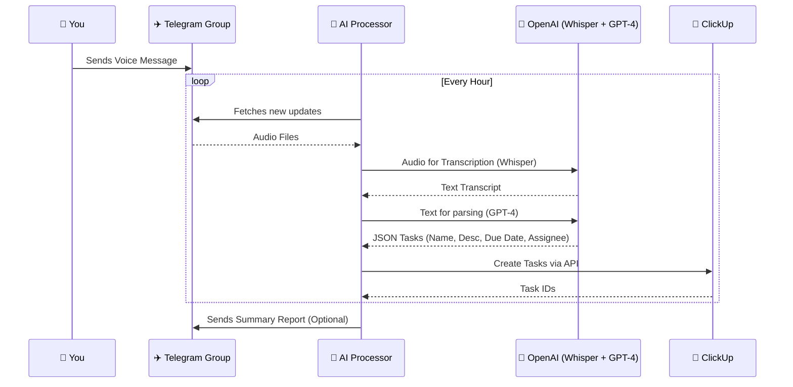

<div align="center">
  
  
  

  # Telegram → ClickUp AI Integration

  **Automate your task creation with Voice. Speak your ideas in Telegram, get structured tasks in ClickUp.**

  [](https://www.python.org/downloads/release/python-390/)
  [](https://openai.com/)
  [](https://clickup.com/api)
  [](#)

</div>

---

## ✨ Overview

Stop typing out lengthy task descriptions. This integration seamlessly connects your **Telegram** group to your **ClickUp** workspace using **OpenAI's** advanced AI models. Just send a voice message, and the system will transcribe it, extract action items, and create perfectly formatted tasks with deadlines, priorities, and assignees.

### 🚀 Key Features

- 🎙️ **Universal Audio Support** — Works with voice notes (`.ogg`), audio files (`.mp3`, `.m4a`, `.wav`), and forwarded messages.
- 🧠 **Smart AI Extraction** — Powered by OpenAI *Whisper* for flawless transcription and *GPT-4* for extracting structured data.
- 📅 **Intelligent Deadlines** — Understands relative dates like *"tomorrow at 3 PM"* or *"next Friday"*.
- 🔔 **ClickUp Reminders** — Automatically creates native ClickUp reminders before the deadline hits.
- 🛡️ **Fail-safe Architecture** — Robust error handling, rate-limit backoffs (429), and atomic state saving to ensure no message is ever lost.

---

## 🏗️ How It Works


```mermaid
sequenceDiagram
    participant User as 👤 You
    participant TG as ✈️ Telegram Group
    participant App as 🤖 AI Processor
    participant OAI as 🧠 OpenAI (Whisper + GPT-4)
    participant CU as 🎯 ClickUp

    User->>TG: Sends Voice Message
    loop Every Hour
        App->>TG: Fetches new updates
        TG-->>App: Audio Files
        App->>OAI: Audio for Transcription (Whisper)
        OAI-->>App: Text Transcript
        App->>OAI: Text for parsing (GPT-4)
        OAI-->>App: JSON Tasks (Name, Desc, Due Date, Assignee)
        App->>CU: Create Tasks via API
        CU-->>App: Task IDs
    end
    App->>TG: Sends Summary Report (Optional)
```

---

## 🛠️ Quick Start

### 1. Prerequisites
- Python 3.9 or higher.
- A Telegram Bot Token & Group Chat ID (Add the bot to your group and make it **Admin**).
- An OpenAI API Key.
- A ClickUp Personal Token and a List ID.

### 2. Installation
Clone the repository and install the locked dependencies:

```bash
git clone https://github.com/viorabuild/telegram_clickup_integration.git
cd telegram_clickup_integration
pip install -r requirements.lock
```

### 3. Secrets Registration
Create a `api_secrets.json` file in `~/.api_secret_infos/` or set the following environment variables:
```bash
export TELEGRAM_BOT_TOKEN="your_bot_token"
export TELEGRAM_CHAT_ID="-1234567890"
export OPENAI_API_KEY="sk-..."
export CLICKUP_TOKEN="pk_..."
```

### 4. Configuration
Edit `config.json` to map your workflow:
```json
{
  "clickup_list_id": "901515871754",
  "telegram_check_hours": 1,
  "timezone": "Europe/Moscow",
  "send_summary_to_telegram": true
}
```
*(See the [Configuration section](#-configuration-details) for advanced settings like team aliases and retention policies).*

### 5. Run the Processor
To manually trigger a sync:
```bash
./run.sh
```
*Tip: Set this script up as an hourly cron job on your server!*

---

## ⚙️ Configuration Details

<details>
<summary><strong>Click to expand full config.json explanation</strong></summary>

- `log_retention_days` / `tasks_retention_days`: Auto-cleanup for local logs. Set to `0` to keep forever.
- `store_transcriptions`: Set `false` for strict privacy (won't save raw text).
- `clickup_member_cache_hours`: Reduces API calls by caching ClickUp team members locally.
- `download_max_workers` / `openai_max_workers`: Concurrency limits for faster batch processing.
- `assignee_map` & `assignee_aliases`: Map spoken names to ClickUp Member IDs. E.g., `"john": [123456]`.
- `create_clickup_reminders`: Whether to create a push notification in ClickUp `reminder_offset_hours` before the deadline.

</details>

---

## 🧪 Advanced Usage

### 🕵️ Dry Run Mode
Test the transcription and extraction without actually creating tasks in ClickUp:
```bash
python3 process_voice_messages.py --dry-run --limit 2
```

### 🔄 Emergency Recreate
If ClickUp was down or you want to recreate tasks from the last processed batch:
```bash
python3 create_clickup_tasks.py --force
```

---

## 📊 Analytics & Reporting

All runs are beautifully documented in markdown logs locally inside the `logs/` directory. If `send_summary_to_telegram` is enabled, your bot will ping the group with a tiny summary:

> 📋 **Telegram → ClickUp**  
> Сообщений: 3  
> Создано задач: 5  
> Ошибок: 0  
> Время: 12.4 с  
> Лог: processing_log_20251001_160000.md

---

<div align="center">
  <i>Created with ❤️ for seamless productivity.</i>
</div>
